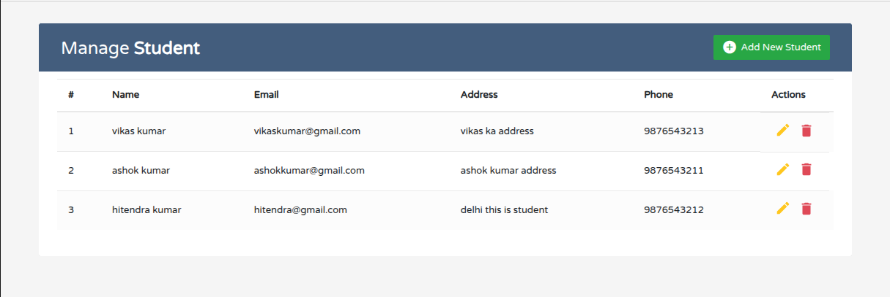
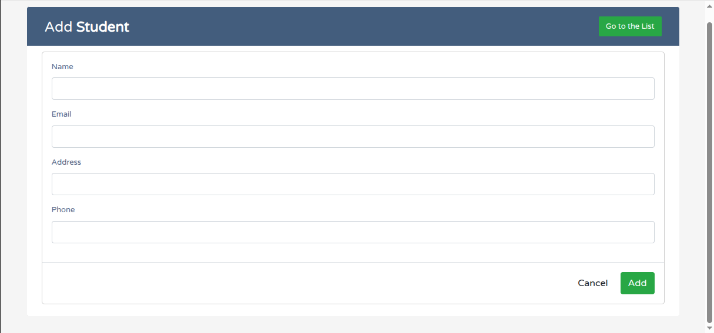
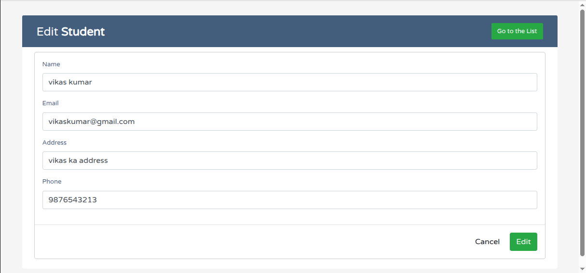

# Simple Python Django PostgreSQL CRUD Project

> A beginner-friendly CRUD web application built with **Python Django and PostgreSQL**, demonstrating Create, Read, Update, and Delete operations with a database.

---

## About the Project

**Simple Python Django and PostgreSQL CRUD Project** is a web-based application developed using the Django framework.

The main purpose of this project is to demonstrate how Django can be used to build a database-driven application with complete **CRUD functionality**.

The project covers the basic Django development workflow:

- Django project and application structure
- Models
- Views
- URLs
- Templates
- Forms
- Database operations
- Static files
- CRUD functionality

---

## Project Objectives

The project was created to understand and demonstrate:

- How Django applications are structured
- How Django models interact with a database
- How to create database records
- How to retrieve and display records
- How to update existing records
- How to delete records
- How Django URL routing works
- How HTML templates interact with Django views
- How form submissions are handled in Django

---

## Features

### ➕ Create

Add a new record using a Django-based HTML form.

### 📋 Read

Display existing records retrieved from the database.

### ✏️ Update

Edit and update an existing record.

### 🗑️ Delete

Remove an existing record from the database.

---

## Technology Stack

| Technology | Usage                  |
| ---------- | ---------------------- |
| 🐍 Python  | Programming Language   |
| 🎯 Django  | Web Framework          |
| 🗄️ SQLite | Database               |
| 🌐 HTML    | Frontend               |
| 🎨 CSS     | Styling                |
| 🔧 Git     | Version Control        |
| 🐙 GitHub  | Source Code Management |

---

## 🖥️ Application Screens

### 📋 Record List

Displays records stored in the database.



### ➕ Add Record

Allows users to create a new record.



### ✏️ Edit Record

Allows users to update an existing record.



---

## Simple Python Django CRUD Project

This guide provides step-by-step instructions to clone, set up, and run the Django CRUD application on your local machine.

---

## 🚀 Installation & Setup

### 1. Clone the Repository
```bash
git clone https://github.com/hitendra-pushkar/simple-python-django-crud-project.git
```

### 2. Navigate to the Project
```bash
cd simple-python-django-crud-project
```

### 3. Create and Activate a Virtual Environment

**Windows:**
```bash
python -m venv venv
venv\Scripts\activate
```

**Linux / macOS:**
```bash
python3 -m venv venv
source venv/bin/activate
```

### 4. Install Dependencies
If the project contains a `requirements.txt` file, install the required packages using:
```bash
pip install -r requirements.txt
```
Otherwise, you can install Django directly:
```bash
pip install django
```

---

## 🗄️ Database Setup

Prepare and apply the database migrations to set up your database schema:
```bash
python manage.py makemigrations
python manage.py migrate
```

---

## ▶️ Run the Application

Start the local Django development server:
```bash
python manage.py runserver
```

Once the server is running, open your web browser and navigate to:
[http://127.0.0.1:8000/](http://127.0.0.1:8000/)

---

## 👨‍💻 Author

### **Hitendra Kumar**
**Software Engineer | Data Engineer | Backend Developer**

---

### 🌟 Professional Summary
**15+ years** of software engineering experience with deep expertise in designing, building, and maintaining robust applications and data pipelines.

---

### 🛠️ Core Expertise

#### **Backend Development**
* **Python** & **Django**
* **PHP**, **Laravel**, & **CodeIgniter**
* **REST APIs**

#### **Data Engineering & Cloud**
* **PySpark** & **Databricks**
* **Data Engineering** pipelines
* **Azure** Cloud Platform

#### **Databases**
* **SQL, MySql, PostgreSQL**

